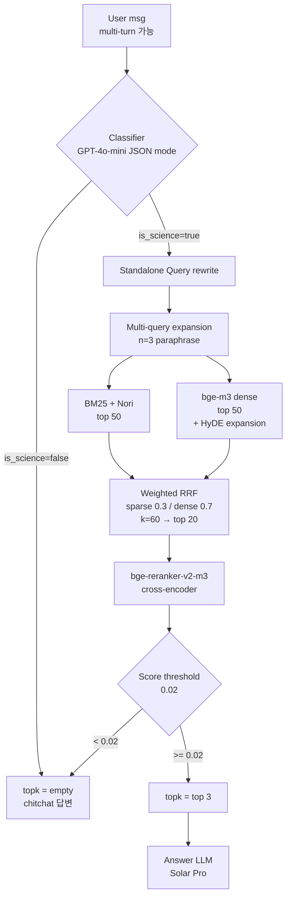

# Korean RAG - Scientific Knowledge Retrieval

> 한국어 과학·상식 도메인 RAG (Retrieval-Augmented Generation) 시스템 설계 및 실험

[]()
[]()

---

## 요약

4,272개 한국어 과학 문서 corpus를 대상으로 사용자 질의에 적합한 top-3 문서를 검색하는 RAG 시스템. Hybrid retrieval (BM25 + dense embedding) + cross-encoder reranker + LLM intent classifier + multi-query expansion 으로 구성.

- Pipeline: Elasticsearch (BM25 + Nori) + bge-m3 (1024d) + bge-reranker-v2-m3 + GPT-4o-mini (classify/rewrite) + Solar Pro (answer)
- Public LB 최고: MAP 0.9348 (Phase 4, baseline 0.6955 대비 +34%p)
- Private 최고 일반화: MAP 0.9242 (Phase 5, classifier-only 단순 구성) - Public LB는 −0.011 낮지만 private set에서 가장 잘 일반화 → Public/Private generalization gap 인사이트 도출
- 5-Phase 점진적 개선: classifier evolution → corpus 광범위성 발견 → score threshold + multi-query → 패턴 규칙 처리 → V5 classifier
- 3종 Negative Results: cross-encoder FT, Qwen3-Reranker 8B 교체, Qwen3-Embedding 8B 교체 + 3-way ensemble

---

## Architecture



---

## Results - 5-Phase Score Progression

| Phase | 변경 | Public LB MAP | Δ |
|---|---|---|---|
| Baseline | GPT-3.5 + Elasticsearch (default) | 0.6955 | - |
| Phase 1 | + Hybrid (BM25+bge-m3) + bge-reranker + V4 classifier prompt | 0.7667 | +0.0712 |
| Phase 2 | classifier=none (intent gate 제거) | 0.8318 | +0.0651 |
| Phase 3a | + score_threshold 0.05 | 0.8939 | +0.0621 |
| Phase 3b | + HyDE | 0.9000 | +0.0061 |
| Phase 3c | + Weighted RRF (sparse 0.3 / dense 0.7) | 0.9152 | +0.0152 |
| Phase 3d | + multi-query n=3 + threshold 0.02 | 0.9258 | +0.0106 |
| Phase 4 (Public LB 최고) | + force-empty 패턴 규칙 도입 (Standalone Query 패턴 매칭) | 0.9348 | +0.0090 |
| Phase 5 (Private 최고 일반화) | Classifier-only 재구현 (eval 적합 패턴 규칙 제거) | 0.9242 | −0.0106 vs Phase 4 |

> Public ↔ Private gap: Phase 4의 패턴 규칙 도입이 public LB에는 +0.009 이지만 private set에선 오히려 손해. Phase 5의 단순한 classifier-only 구성이 public 0.9242 (−0.011 vs Phase 4) 임에도 private에서 가장 잘 일반화. → public 점수만으로 실험 폐기 결정의 위험성 교훈.

---

## Approach

### Phase 1 - Hybrid Retrieval Baseline

Baseline (sparse-only) 0.6030 → bge-m3 dense 추가 → RRF fusion → bge-reranker → 0.7295.
- Sparse: Elasticsearch BM25 + Nori (한국어 형태소 분석, decompound mixed)
- Dense: bge-m3 (한국어 강세, 1024d, cosine)
- Reranker: bge-reranker-v2-m3 (cross-encoder, top 20 → top 3)
- Classifier: GPT-4o-mini JSON mode + V4 prompt (CS·연구방법론·인물 과학 범주 편입)

Phase 1 → V4 prompt 단독으로 +0.019 (전체 단계 중 두 번째로 큰 단일 개선).

### Phase 2 - Classifier OFF: Corpus 광범위성 발견

V4 prompt도 *"비과학"으로 판정하던* 질의 다수가 사실 corpus에 GT 보유하는 것을 발견:
- eval_id 213 ("공교육 지출") → corpus의 "2017 공공 교육 지출 GDP 4%" 매칭
- eval_id 42 ("이란-콘트라 사건") → corpus의 "1987 이란-콘트라" 매칭
- eval_id 81 ("통학버스 가치") → corpus의 학교 버스 안전 문서 매칭

핵심 인사이트: 코퍼스 = MMLU + ARC 한국어 번역. 자연과학 외에 사회·역사·생활상식 docs 다수 포함. "과학성 vs 비과학성" 이분법은 도메인 오인식.

→ classifier=none (의도분류 gate 제거) 으로 전환 → +0.065 (가장 큰 단일 개선).

### Phase 3 - Score Threshold + Retrieval Tuning

Classifier 끄면 chitchat 질의도 검색됨 → rerank top-1 score 임계값으로 일반 메커니즘 도입.
- 218 "요새 너무 힘드네" → score 0.084
- 220 "너 지능있어?" → score 0.04
- → threshold 0.05 (이후 0.02로 추가 하향)

추가 튜닝:
- HyDE: 가상 답변 문서 생성해 dense 쿼리 보강
- Weighted RRF: sparse 0.3 / dense 0.7 (sweep 결과 sweet spot)
- Multi-query n=3: SQ paraphrase로 검색 robustness 확보

→ 0.9258 (제출용 안전 라인).

### Phase 4 - 패턴 규칙 처리 + Public/Private Split 진단

Borderline 질의(score 0.02~0.10) 정밀 처리. Standalone Query에 특정 패턴이 매칭되면 검색 결과를 강제 조정:
- 감정 표현 패턴 ("힘들다", "힘든 상황" 등): 검색 결과 강제 비움
- AI 자기지칭 패턴 ("너는 누구", "넌 잘하는 게" 등): 검색 결과 강제 비움
- 인물·전기 패턴 ("일대기", "위인" 등): rescue 후보에서 제외

추가 발견 (실험적 진단):
- temperature = 0, seed = 1 고정에도 LLM 비결정성 발견
- 같은 코드 두 번 돌리면 ±0.005~0.01 LB 변동 → multi-query LLM 비결정성 → LLM cache 도입으로 결정성 확보

### Phase 5 - V5 Classifier + Retrospective

원리적 접근으로 패턴 규칙 의존 줄이는 시도:
- V5 prompt: corpus scope 명시 + recall-bias ("애매하면 is_science=true")
- 비과학을 5 카테고리로 한정 (인사·AI자기지칭·위로·취향·메타)

결과: V5 LB 0.9212 (−0.0167 후퇴).
원인: V5도 "감정 지원" "여행 좋은점" "남녀관계 정서" 같은 경계선 케이스 차단 → corpus의 사회·심리 docs와 충돌.

→ 재발견: classifier=none + 패턴 규칙 처리가 corpus 광범위성에 가장 정합한 구조였음.

---

## 효과 없었던 시도 (Negative Results)

> 체계적으로 시도해 효과를 측정한 후 채택 안 한 접근들. "실패"보다는 학습 가치가 큰 negative results.

### 1) Cross-encoder Reranker Fine-tuning

bge-reranker-v2-m3 추가 학습 시도 (3 버전 v1/v2/v3).

파이프라인:
1. Pseudo query 생성: 4,272 docs × 3 questions × 2 LLMs (Solar+GPT-4o-mini) = 25,632 (Q, D+) pair
2. Hard negative mining: 각 query에 BM25 top-10 + dense top-10 → positive 제외 → 상위 5개 채택
3. Cross-encoder FT (positive label 1.0, negative label 0.0)

결과: id=100 score 0.915 → 0.024 (−0.891, catastrophic regression).

원인: GT 라벨 부재 → "다른 문서 = negative" 가정 → BM25/dense 상위는 사실 정답급 유사 문서들이라 false negative 오염. Reranker가 "정답에 가까운 docs를 0으로 출력"하도록 잘못 학습됨.

학습: 데이터 품질이 모델 크기보다 우선. GT 없는 IR domain에서의 self-supervised hard negative mining은 구조적 한계.

### 2) Reranker 모델 교체 (Qwen3-Reranker 8B)

Qwen3-Reranker-8B (bge 560M의 14배 규모)로 교체 시도.

구조 차이:
- bge: cross-encoder, 직접 score 출력
- Qwen3: LLM-as-judge ("문서가 답을 포함하는가? yes/no") logprob 기반 score

결과: 단독 LB 0.8697 (−0.0561), Rescue 모드 0.9197 (−0.0061).

원인:
- Qwen3 score 분포가 bge와 달라 임계값 호환 안 됨
- Qwen3는 web QA 학습 (corpus와 도메인 mismatch)

학습: 모델 크기 ≠ 도메인 적합성. SOTA 모델도 학습 분포가 다르면 손해.

### 3) Qwen3-Embedding 8B 교체 + 3-way Ensemble

bge-m3 (1024d) 외에 Qwen3-Embedding-8B (4096d) 를 FAISS 인덱스로 추가해 3-way ensemble 구성.

구성:
- Sparse: BM25 (기본)
- Dense: bge-m3 (1024d, ES 통합)
- Extra: Qwen3-Embedding-8B (4096d, FAISS - ES dense_vector 2048d 한도 우회)
- Weighted RRF (k=60) → top 20 → bge-reranker → top 3

결과: LB 0.9212 (−0.0046 vs baseline 0.9258). Qwen3 가중치 0.5~2.0 sweep, reranker 후보군 20→40 확장 모두 효과 미미.

원인 분석:
- Qwen3-Embedding-8B vs bge-m3 top-1 91% 일치 → 91%는 같은 결과로 RRF 효과 없음
- 차이 9%만 새 시그널이지만 그마저도 bge-reranker가 score 낮게 매겨 최종 top-3에 못 올림
- 사례: eval_id=37 "모자 만드는 직업" - Qwen3-8B가 정답 doc을 rank 1으로 가져왔으나 bge-reranker score 0.0075 (threshold 0.02 미만) 으로 empty 처리

학습: 검색 파이프라인에서 임베딩은 후보 수집, reranker가 최종 결정권자. 임베딩만 강화해도 reranker 도메인 적합성이 부족하면 효과 없음. SOTA 모델 도입 ≠ 자동 개선.

---

## Key Engineering Decisions

### LLM Cache for Reproducibility
```python
key = SHA256(provider + model + messages + temperature + seed + response_format)
cache_path = f".llm_cache/{key}.json"
```
- OpenAI API의 `temperature=0` 비결정성 문제 해결 (multi-query · HyDE 변동 제거)
- A/B 변량 실험에서 LLM 응답 고정 → 순수 retrieval 효과 측정 가능
- 1회 실행 후 검색 파라미터만 바꾸는 sweep 비용 0

### JSON Mode > Function Calling
- Baseline은 OpenAI function calling (`tools=[search]`)
- 우리는 `response_format={"type": "json_object"}` 로 전환
- 출력 스키마 결정성 + 캐시 호환성 + 다른 LLM (Solar/Qwen) 이식성

### Cosine > L2-norm for Embedding Similarity
- baseline KR-SBERT는 l2_norm 학습 → bge-m3는 cosine 기반 contrastive loss 학습
- ES `similarity=cosine` + `normalize_embeddings=True` + FAISS `IndexFlatIP` 로 통일
- Score 범위 [0, 1] 고정 → threshold 튜닝의 의미가 안정

---

## Retrospective: What I Learned

### 1) 데이터 양 ≠ 품질
> 💡 GroundTruth 기반 negative 없는 구조적 한계.

Cross-encoder reranker FT 시도에서 25,632 pseudo (Q, D+) pair를 만들었지만, GT 라벨 부재로 BM25/dense 상위 문서를 negative로 가정. 결과적으로 정답급 유사 문서들이 false negative로 오염되어 catastrophic regression (id=100 점수 0.915 → 0.024). 양보다 라벨 품질이 학습 효과를 결정.

### 2) SOTA 벤치 ≠ 도메인 성능
> 💡 파라미터 크기(14배)로도 정답 vs 오답 구분 감각 격차는 극복 불가.

Qwen3-Reranker 8B (bge 560M의 14배)로 교체 시도 → −0.0561. 모델 규모는 크지만 web QA 학습 분포라 우리 corpus 도메인과 mismatch. SOTA 벤치마크 점수와 특정 도메인 적합성은 별개 차원.

### 3) Architecture Bottleneck - Reranker가 결정권자
> 💡 임베딩이 정답을 가져와도 reranker가 받아주지 않으면 무효.

Qwen3-Embedding 8B를 FAISS 3-way ensemble로 추가 → bge-m3 top-1과 91% 일치. 차이 9%만 새 시그널이지만 그마저도 bge-reranker가 받아주지 않아 최종 top-3에 못 올림. 검색 파이프라인에서 reranker가 사실상 최종 결정권자, retrieval 강화만으로는 효과 미미.

---

## Tech Stack

| Layer | Tool | 선택 이유 |
|---|---|---|
| Sparse retrieval | Elasticsearch + Nori | 한국어 형태소 분석, decompound mixed로 복합어 부분 매칭 |
| Dense retrieval | bge-m3 (1024d) | 한국어 SOTA 임베딩, ES dense_vector 한도 내 |
| Cross-encoder | bge-reranker-v2-m3 | 한국어 IR rerank SOTA, 약 800MB |
| LLM (classify/SQ) | GPT-4o-mini | 가성비, JSON mode 안정성 |
| LLM (answer) | Solar Pro (Upstage) | 한국어 생성 품질, MAP 평가 무관이라 비용 절감용 |
| Vector store (extra) | FAISS IndexFlatIP | ES 차원 한도(2048d) 우회 + L2 norm으로 cosine 구현 |
| Cache | SHA256 + 디스크 JSON | LLM 결정성 확보 |
| Experiment tracking | Markdown notes/ | 가벼운 setup, git diff로 변경 추적 |

---

## Reproduction

### 1) Setup

```bash
# 의존성
pip install -r requirements.txt

# Elasticsearch (8.8.0) 설치 + Nori 플러그인
./install_elasticsearch.sh

# 환경변수 설정
cp rag_system/.env.template rag_system/.env
# OPENAI_API_KEY, ES_PASSWORD, UPSTAGE_API_KEY 입력
```

### 2) 데이터 준비

```bash
# 대회 제공 documents.jsonl, eval.jsonl 을 data/ 에 배치
ls data/
# documents.jsonl  eval.jsonl
```

### 3) 인덱싱 + 평가

```bash
cd rag_system

# 인덱싱 (임베딩 모델 1회만)
python rag.py index --exp baseline

# 평가 (Phase 3 best 단독 파이프라인)
python rag.py eval \
    --exp my-best \
    --classifier none \
    --hyde \
    --rrf-weight-sparse 0.3 \
    --rrf-weight-dense 0.7 \
    --multi-query --multi-query-n 3 \
    --score-threshold 0.02 \
    --llm-cache
```

---

## Repo Structure

```
.
├── rag_system/
│   ├── rag.py                                       # 메인 파이프라인 (단일 파일, ~1500 LOC)
│   ├── rag_exp-02-003-14-tau002-empty-hardship.py  # Phase 4 재현 (Public LB 최고 0.9348)
│   ├── rag_exp-02-003-17.py                         # Phase 5 재현 (Private 최고 일반화 0.9242)
│   ├── generate_pseudo_queries.py                   # Reranker FT 학습 데이터 생성
│   ├── finetune_reranker.py                         # Cross-encoder FT
│   ├── ensemble.py                                  # RRF ensemble 도구
│   ├── analyze_score_threshold.py                   # threshold sweep 분석
│   ├── notes/                                       # 실험 기록 (markdown)
│   │   ├── 01_submissions.md                        # LB 제출 로그 + 회고
│   │   ├── 02_score_threshold_analysis.md           # threshold 튜닝 deep dive
│   │   └── README.md
│   └── .env.template
├── EDA/                                             # 초기 EDA (Jupyter 노트북 + 차트 5개)
├── requirements.txt
├── LICENSE
└── README.md (this file)
```

---

## License

MIT (코드 부분). 데이터셋은 각 출처 라이선스 적용 (ARC: CC-BY-SA 4.0, MMLU: MIT).
